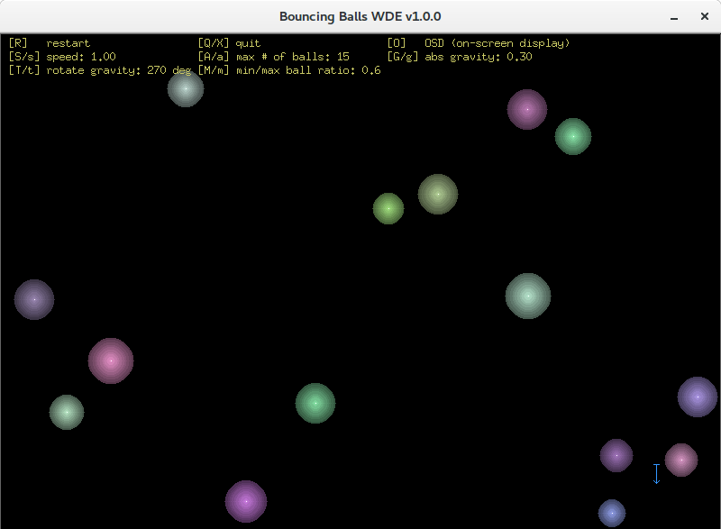

# balls-wde

Bouncing balls demo written in Go, using [go.wde](https://github.com/skelterjohn/go.wde) for graphics and events.

You can find a variant of this using [Ebiten](github.com/hajimehoshi/ebiten) for graphics and events here:
[github.com/icza/balls-ebiten](https://github.com/icza/balls-ebiten).

Another variant using [go-sdl2](https://github.com/veandco/go-sdl2) for graphics and events:
[github.com/icza/balls-sdl](https://github.com/icza/balls-sdl).

Screenshot:

